# IBM Cloud Pak for Multicloud Manager Labs

# Lab #2: Create a VM with Service Manager


Philippe Thomas - September 2020


# Introduction

During this lab, we are going to manipulate some basic aspects of the **console** of IBM Cloud Pak for Multicloud Manager (CP4M for short in this document) and especially the **import** feature to get access to some managed clusters. 


#Task 1 - Access CP4M console

Be sure to use the latest **Firefox** internet browser.  

To get access the CP4M console, the instructor will give you a URL similar to the one below:

```http
https://cp-console.niceaz-ba36b2ed0b6b09dbc627b56ceec2f2a4-0000.ams03.containers.appdomain.cloud
```

The Credentials are **admin** and a password given by the instructor.  

Then you should see the following sign on page:


For this exercise, we want to get access to the **Cluster Administrator** role, so click on the Default authentication link in the page:


Then type **admin** and the  password from the instructor.


Click **Log in** and here it is : the welcome page should appear:


# Task 2 - Service Manager

By using the Managed services, you can automate  provisioning of infrastructure and virtual machine applications across  multiple cloud environments with optional workflow orchestration.

The Managed services was previously called as Terraform &  Service Automation or IBM Cloud Automation Manager. For documentation  for previous versions of IBM Cloud Automation Manager, see the [IBM Cloud Automation Manager Knowledge Center ](https://www.ibm.com/support/knowledgecenter/en/SS2L37/product_welcome_cloud_automation_manager.html?view=kc).

Managed services is a multi-cloud, self-service management  platform running on IBM Cloud Pak for Multicloud Management that  empowers developers and administrators to meet business demands.

Service Composer from the Managed services allows you to expose  cloud services to any cloud through the Service library. It accelerates  developer velocity and improves governance.

Managed services uses open source Terraform to manage and  deliver cloud infrastructure as code. Cloud infrastructure delivered as  code is reusable, able to be placed under version control, shared across  distributed teams, and it can be used to easily         replicate environments. Managed services brings a common  approach to automate all workloads in all clouds to reduce configuration  errors and improve operational efficiency. You can manage  infrastructure as code using HashiCorp Terraform software.

The Managed services content library comes pre-populated with  sample templates to help you get started quickly. It allows you to  leverage IBM, community, and home-grown assets as building blocks and  modernize legacy applications and build new cloud         native applications. Use the sample templates as is or customize  them as needed. A Chef runtime environment can also be deployed using  Managed services for more advanced application configuration and  deployment.

The locally installed Template Designer accelerates development of reusable Terraform automation.

With Managed services, you can provision cloud infrastructure  and accelerate application delivery into multiple cloud environments  with a single user experience.

You can spend more time building applications and less time  building environments when cloud infrastructure is delivered with  automation. You are able to get started fast with pre-built  infrastructure from the Managed services library.


# Task 3 - Check your connection

We already have defined a cloud connection to IBM Cloud for you. So you don't have to create a new one.

The name of the connection is **KEVIN**.

Go to the **Manage Service**:


Then:

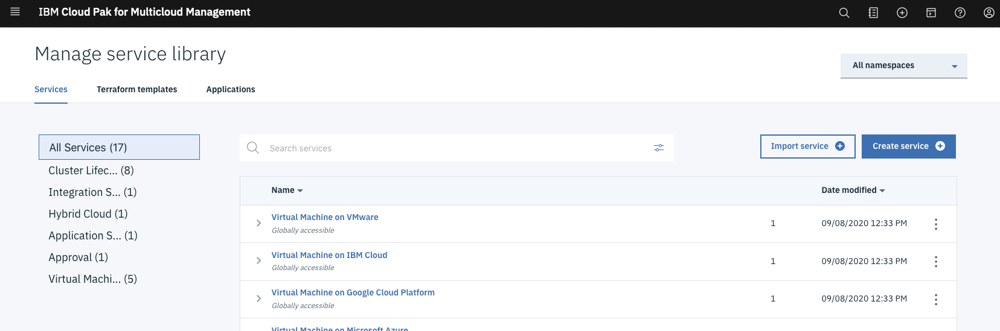

In this page, you should have 3 tabs :

- Services : this is where you can define and manage composite services and publish them to group of users.
- Terraform: you will find examples of terraform templates to define basic resources (like VMs)
- Applications: here can define hybrid applications based on VMs and Containers.


In the menu, look for **Manage > Cloud Connections** (you will notice that the menu is now shorter than the previous one: this is because we are now in the Service Manager):


Then look at your connections:

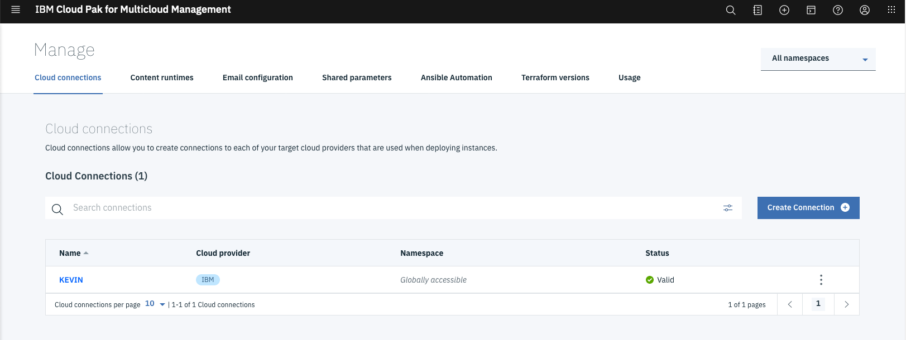


Click on Kevin to watch at the connection:


Scroll the page to see some credentials (don't modify them)

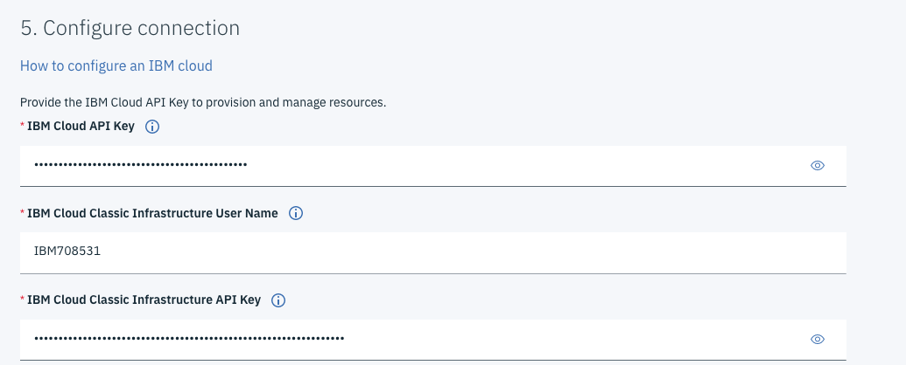


Exit and check the **Status** : it should be **valid**

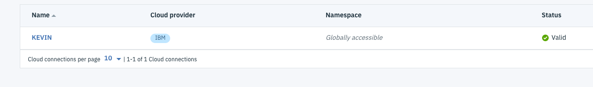

You can also create connections to many different kinds of Clouds or any infrastructure where you want to deploy VMs or Containers and Orchestration solutions. 


# Task 4 - Deploy a basic VM 

Next step is to check that we can deploy a basic VM. 

Goto **Menu > Library > Terraform templates**

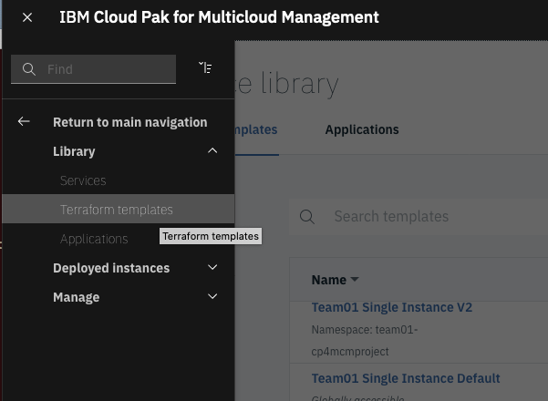


And you should get all the templates (templates are examples that you can use with parameters):

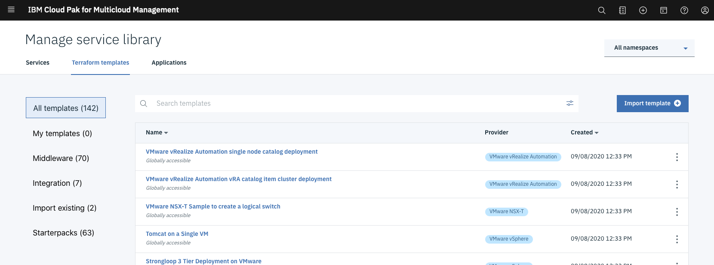


Find the following template:

```
Virtual Server with SSH key
```

Results:

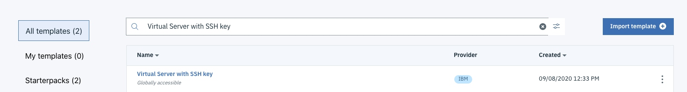


Click on the template.

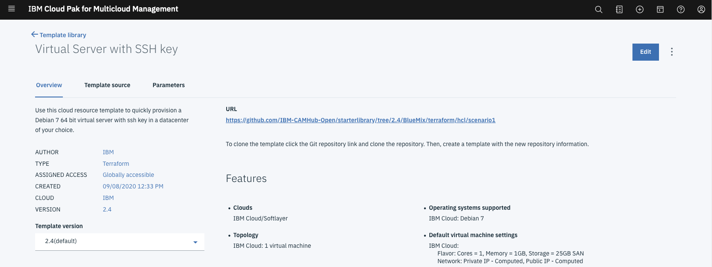

Before clicking on deploy, you can look at the terraform code: click on the **URL**


You can look at the scenario.tf file which represents the creation of the VM resource:

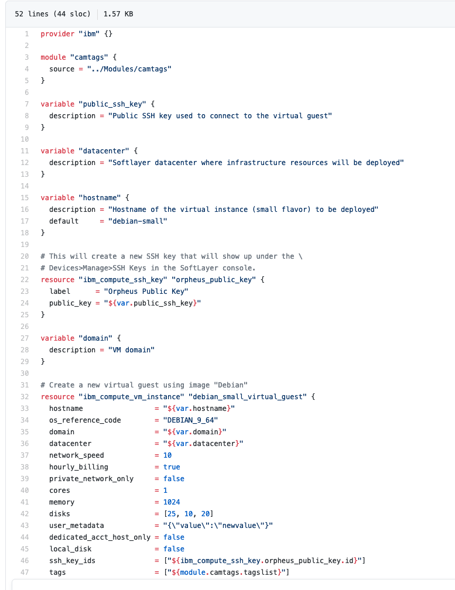

Go back to **template page** and click on **Deploy**:

Then choose the r**equested parameters** and enter the following values:

- labproj<xx> where xx is your number
- nicevm<xx> where xx is your number
- KEVIN for the cloud connection
- 0.11.11 for your version


In the next field you should provide a **ssh key**. On a terminal or a command line window, type the following commands ( **IPADDRESS** is the one given by the instructor and <xx> is your number )

```cd
ssh root@<IPADDRESS> 
cd
mkdir terra
cd terra
ls -l
ssh-keygen -f sshkey<xx> -P ""
cat sshkey01.pub
```

Results:

```bash
[root@niceay ~]# cd
[root@niceay ~]# mkdir terra
[root@niceay ~]# cd terra
[root@niceay terra]# ls -l
total 0
[root@niceay terra]# ssh-keygen -f sshkey01 -P ""
Generating public/private rsa key pair.
Your identification has been saved in sshkey01.
Your public key has been saved in sshkey01.pub.
The key fingerprint is:
SHA256:ANDsSko5GXIUAvXm4kddxBvKjlgKwbmyW/Hj/Z9Cmd0 root@niceay.ibm.ws
The key's randomart image is:
+---[RSA 3072]----+
|=o*=.  ..        |
|o=..o. .o        |
|.o=.o....o       |
|o*ooo.oo.        |
|o=oBoo. S+ .     |
|o.=o+ . + . E    |
| o...o .         |
|.  .. . .  .     |
|       ..oo      |
+----[SHA256]-----+
[root@niceay terra]# cat sshkeyba.pub
ssh-rsa AAAAB3NzaC1yc2EAAAADAQABAAABgQDFbkUj0C2nCiNsiNVe8h/HdCem5S5vj15j0RUCeqhUJGGtaMIZsHVXxGS/pKqI5SmaWx1iIUA85TM45+kFwJ3CZqLN1+OJowvSpu/3dcGBvY86ToPu8ieXMQdWzdi47BeSyqfa3LHizQry+A/fm1OnSD29HvGDhSD+Ca9u3UWw7Ix1NZ4EJfjk2aZcExnGMaZhjhPUAPs4MgMyk+rbxXENJBCnkW/ITCmueoKJUcbS+rPE+rSLHyXJEQsf1UEeSpdSmqgbHniUul8WP9vE8Da8FEGmLDa221u0k6BRFqG+m4IwOIx0/N4UVoAu5RZBIS0xF3iXLtonXqVsZFxilVJhhh8MSTwo5QWNXa8BhENoN26ekZXLr/d6OEiJc9Olya3guZW3nkILv6tJFiwMvQKlH+hAQlZkfVJo8hFGGY1HAm6pVQUkFzAMedSzR7Q+pRuYRalnBR12k9CWYLPKrOgwbtXGJmeDsMN53GNF9MLQET7mGbEsNnqeUEOcPT4rI/c= root@niceay.ibm.ws
[root@niceay terra]# 
[root@niceay terra]# 
```

From the last command, copy and past the results to the "Enter Public SSH key" in the page:

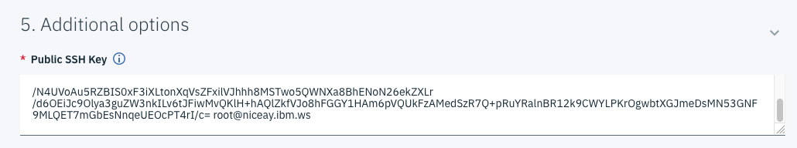

Finally in the last fields: enter **London**, **nicevm<xx>**, and **ibm.ws**


Click **Deploy** at the bottom.


The VM provisioning should be "**in progress**". 

Click on **log file** at the top of page. You should see the progressing log file:

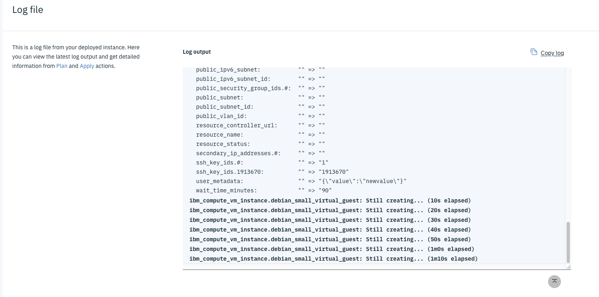

Wait for about 5 minutes.

Finally, you will get the IP address at the end of the log file:

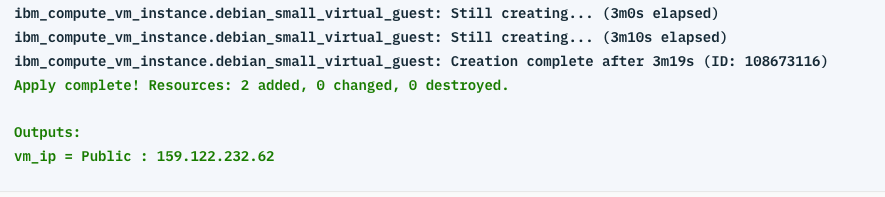

Take a note of the IP address <IP>

Go back to the terminal in the terra directory. Use the sshkey<xx> that you created and the <IP>. 

```
ssh -i sshkey<xx> root@<IP>
```

Example:

```bash
# ssh -i sshkey01 root@159.122.232.62
The authenticity of host '159.122.232.62 (159.122.232.62)' can't be established.
ECDSA key fingerprint is SHA256:LacLXCs4Umn85tV/dFMoUA2us7HbW7PAO7+mCf7JL1s.
Are you sure you want to continue connecting (yes/no/[fingerprint])? yes
Warning: Permanently added '159.122.232.62' (ECDSA) to the list of known hosts.

The programs included with the Debian GNU/Linux system are free software;
the exact distribution terms for each program are described in the
individual files in /usr/share/doc/*/copyright.

Debian GNU/Linux comes with ABSOLUTELY NO WARRANTY, to the extent
permitted by applicable law.
root@nicevm01:~# 

```

You should be now connected to the newly created VM. 

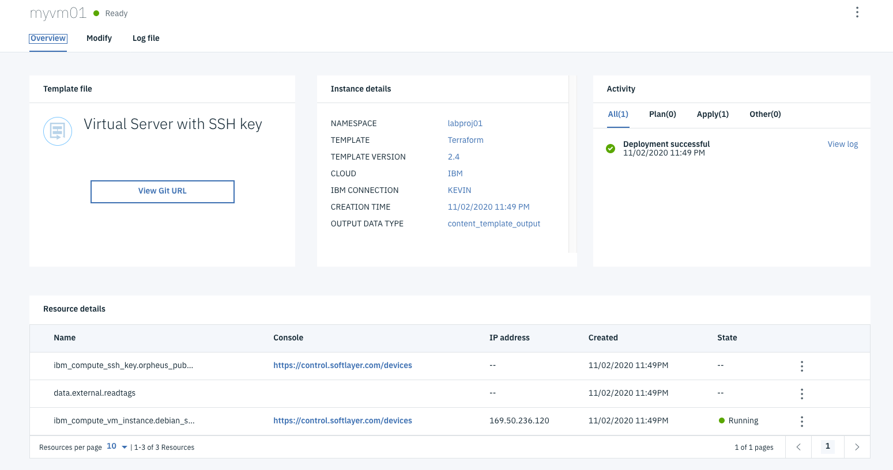


# Task 5 - Destroy the VM 

Go to the **Menu > Deployed Instances > Terraform Templates**

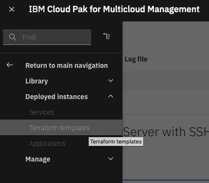


Locate your VM <xx> and goto to the 3 dots at right end of the line:

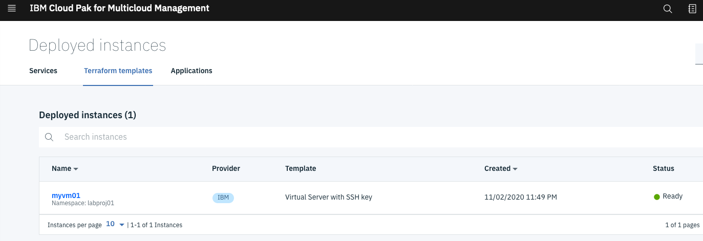

Click on destroy resources (to really delete the VM):

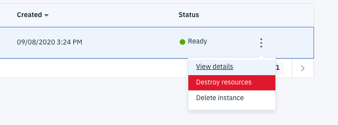

Enter **destroy**  and click on **Destroy** button:

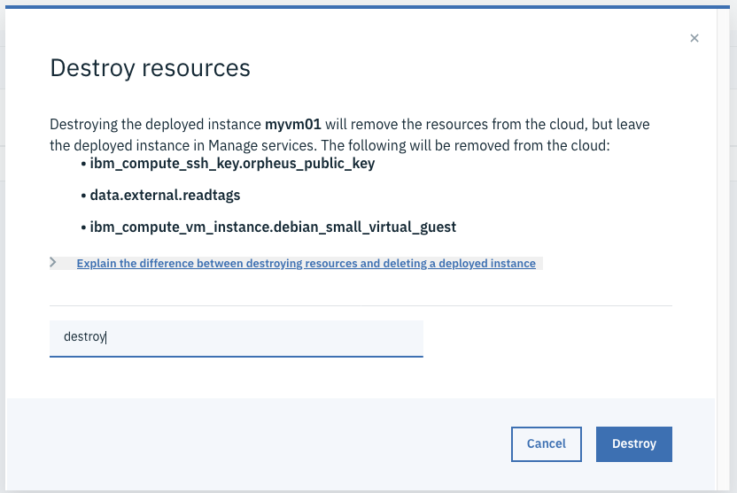

Wait a few minutes.

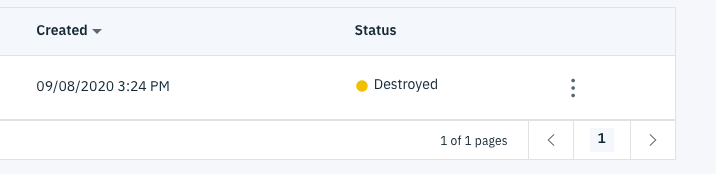

Then click again on the 3 dots and pick **Delete** this time:

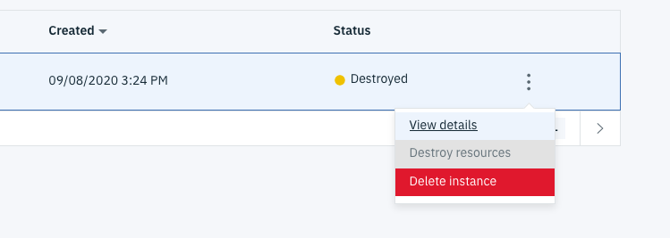

Then type **delete** and click on the **Delete** button:

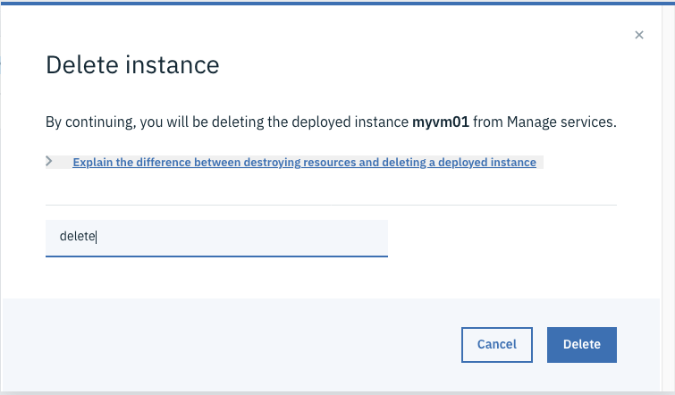

Wait a few seconds and you see either no instance or only the other ones. 

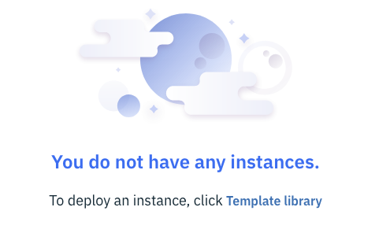


# Congrats

You successfully accessed the CP4M console, you visited the service manager and created a VM on IBM Cloud and destryed it. 


Thanks.

---

