# IBM Cloud Pak for Multicloud Manager Labs

# Lab #3: Deployables


Philippe Thomas - November 2020


# Introduction

IBM Cloud Pak for Multicloud Management enables you to securely  **manage applications**, wherever your applications are deployed. IBM Cloud  Pak for Multicloud Management provides you with tools and a hybrid  application model that you can use to create applications and application resources across different  deployment platforms, manage the lifecycle of your applications and  infrastructure, and deliver observability for the application’s full  stack.

The application management functions within IBM Cloud Pak for  Multicloud Management provide you with unified and simplified options  for constructing and deploying applications and application updates.  With these functions, your developers and DevOps personnel can create and manage applications across  environments.

To achieve this goal, IBM Cloud Pak for Multicloud Management  uses a **Hybrid Application Model**. This model includes default Kubernetes  resource definitions and custom resource definitions to represent and  manage application components.

In the previous versions of IBM Cloud Pak for Multicloud  Management, all applications and application resources were based on the  **Kubernetes Special Interest Groups (SIG) Application model**. With this  hybrid application model, custom resources are  added to support representing **non-Kubernetes resources** with  Kubernetes custom resources to manage these resources as part of an  Application. For instance, you can represent your infrastructure  deployers, such as Infrastructure management or Ansible         as `Deployer` resources. With the support for  infrastructure deployers, you can create hybrid deployable resources  that represent components that run on these different Deployers, such as  virtual machines, cloud services, and containers.

The applications that you create by blending the Kuberenetes  resources with non-Kubernetes resources are known as hybrid  applications. The Kubernetes resource specification for representing a  hybrid application with this hybrid application model  is still the standard Kubernetes `Application` resource that was used in previous versions of the IBM Cloud Pak for Multicloud Management. New hybrid deployable (`Deployable.core.hybridapp.io`) and deployer (`Deployer`)   resources are introduced and work alongside the existing deployable (`Deployable.app.ibm.com`), channel (`Channel`), subscription (`Subscription`) and placement rule (`PlacementRule`) resources for creating   and managing your hybrid applications.

With this consistent application model, users can visualize  their hybrid applications. Hybrid applications are rendered into a  unified visual experience that brings together application components  that are deployed to VMs and or containers and across   cloud services. These views span teams so that operators can  quickly understand each application. Additionally, this visualization  provides your users with simplified options for constructing and  deploying your hybrid applications and any subsequent  updates to the applications.

With these functions, your developers and DevOps personnel can  create and manage applications across environments and functional teams  through channel and subscription-based automation. During this lab, we are going to manipulate some important aspects of the **console** of IBM Cloud Pak for Multicloud Manager (CP4M for short in this document) and especially the **hybrid application feature** to deploy and move applications to some managed clusters. 


#Task 1 - Access CP4M console

Be sure to use the latest **Firefox** internet browser.  

To get access the CP4M console, the instructor will give you a URL similar to the one below:

```http
https://cp-console.niceaz-ba36b2ed0b6b09dbc627b56ceec2f2a4-0000.ams03.containers.appdomain.cloud
```

The Credentials are **admin** and a password given by the instructor.  

Then you should see the following sign on page:


For this exercise, we want to get access to the **Cluster Administrator** role, so click on the Default authentication link in the page:


Then type **admin** and the  password from the instructor.


Click **Log in** and here it is : the welcome page should appear:


# Task 2 - Define the Application components

This exercise has been inspired by the following github repositories and the Java image : 

- Modresort: A WebSphere Liberty Java application - available in Dockerhub at **kpostreich/modresort**
- https://github.com/phthom/cp4m/holidays

Rather than starting from scratch, we already have downloaded the manifests files into the VM. 

First login to the VM with the credentials (IP and Password) given by the instructor. From you laptop, ssh to the VM:

``` bash
ssh root@<IP>
```

You need to login to the OpenShift Cluster with the oc command. To do so, first go to the OpenShift Console, click on the top right side corner of the OpenShift Console :

 

Choose **Copy Login Command**

The folllowing page will display :


Click on the blue link (Display Token).

The following page appears:

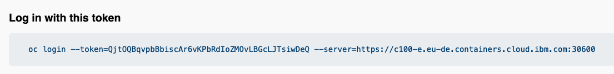

**Copy and Paste the OC LOGIN** command to the **VM terminal** :

```bash
oc login --token=QjtOQBqvpbBbiscAr6vKPbRdIoZMOvLBGcLJTsiwDeQ --server=https://c100-e.eu-de.containers.cloud.ibm.com:30600
```

Results:

```bash
# oc login --token=QjtOQBqvpbBbiscAr6vKPbRdIoZMOvLBGcLJTsiwDeQ --server=https://c100-e.eu-de.containers.cloud.ibm.com:30600
Logged into "https://c100-e.eu-de.containers.cloud.ibm.com:30600" as "IAM#ph_thomas@fr.ibm.com" using the token provided.

You have access to 68 projects, the list has been suppressed. You can list all projects with 'oc projects'
```

You are connected to the OpenShift Hub Cluster.

Now let's connect to the Cloud Pak for Multicloud Management and use the **cloudctl** **login** command.

Check that you have installed cloudctl:

```bash
cloudctl
```

Results:

```bash
cloudctl
NAME:
   cloudctl - A command line tool to interact with IBM Cloud Platform Common Services and IBM Cloud Private

USAGE:
[environment variables] cloudctl [global options] command [arguments...] [command options]

VERSION:
   v3.4.2-1808+e5ed7d09f67f2cc044e15edcd7a92f79bbb996e3

COMMANDS:
   api          View the API endpoint and API version for the service.
   case         [Cloud Platform Common Services only] Manage CASE.
   catalog      Manage catalog.
   cm           Manage cluster.
   completion   Generate an auto-completion script for the specified shell (bash or zsh).
   config       Write default values to the configuration.
   helm-init    Prints the configuration of the HELM_HOST setting for Helm.
   iam          Manage identities and access to resources.
   login        Log user in.
   logout       Log user out.
   metering     Download metering reports.
   plugin       Manage plugins.
   pm           Manage passwords.
   target       Set or view the targeted namespace.
   tokens       Display the OAuth tokens for the current session. Run `cloudctl login` to retrieve the tokens.
   version      Check CLI and API version compatibility.
   help         
   
Enter 'cloudctl help [command]' for more information about a command.

ENVIRONMENT VARIABLES:
   CLOUDCTL_COLOR=false                     Do not colorize output
   CLOUDCTL_HOME=path/to/dir                Path to config directory
   CLOUDCTL_TRACE=true                      Print API request diagnostics to stdout
   CLOUDCTL_TRACE=path/to/trace.log         Append API request diagnostics to a log file

GLOBAL OPTIONS:
   --help, -h                         Show help

```

This command is very usefull to control the security aspects, the catalog, the clusters, helm init variables, metering and finally password and tokens in CP4M. 

To get access to CP4M with the cloudctl command line, type the following **log in** command:

```bash
cloudctl login [-a CLUSTER_URL] [-u USERNAME] [-p PASSWORD]  [-c ACCOUNT_ID or ACCOUNT_NAME] [-n namespace] [--skip-ssl-validation] 
```

For example: 

```bash
cloudctl login -a cp-console.niceaz-ba36b2ed0b6b09dbc627b56ceec2f2a4-0000.ams03.containers.appdomain.cloud -u admin -p <password> -n default
```

> You can get the password for the `admin` username by running the following command:
>
> ```
> oc -n ibm-common-services get secret platform-auth-idp-credentials -o jsonpath='{.data.admin_password}' | base64 -d
> ```
>
> Following is a sample output:
>
> ```
> m7PRCkNMzx4DuZf5H8sVaSPCZnC6Dnyd
> ```
>
> If you get some error be sure you are correctly logged into the cluster using `oc login` and then type cloudctl again. 


Results (as an example):

```bash
# cloudctl login -a cloudctl login -a cp-console.niceaz-ba36b2ed0b6b09dbc627b56ceec2f2a4-0000.ams03.containers.appdomain.cloud -u admin -p W0qhzcskdjgzgfsdfC1AvS1OZ -n default 
OK

Targeted account mycluster Account

Targeted namespace default

Configuring kubectl ...
Property "clusters.mycluster" unset.
Property "users.mycluster-user" unset.
Property "contexts.mycluster-context" unset.
Cluster "mycluster" set.
User "mycluster-user" set.
Context "mycluster-context" created.
Switched to context "mycluster-context".
OK

Configuring helm: /Users/phil/.helm
OK

```

You can now display the cluster HUB status (where CP4M is running):

```bash
cloudctl cm cluster-status
```


With both the CP4M console and the cloudctl command, you are now ready to work.


Go to the holidays directory in the VM:

```bash
cd holidays
```

List all files

```bash
ls *
```

Results (2 files)

```
# ls *
holidays-project<xx>.yaml
holidays-deployables<xx>.yaml

```

> where <xx> is your **number**.


Create a project that contain the deployables (I choosed the same name as the yaml file for simplicity):

```
oc new-project holidays-deployables<xx>
```

Before applying the manifest, list the file:

```bash
cat holidays-deployables<xx>
```

The first part contains the **channel** : the last line contains the path where we get the deployable manifests (in that case, a namespace called holidays-deployables03 - the number will be different for you):

```bash
apiVersion: app.ibm.com/v1alpha1
kind: Channel
metadata:
  name: holidays-chan03
  namespace: holidays-deployables03
  labels:
    app: holidayschan03
spec:
  type: Namespace
  pathname: holidays-deployables03
```

The second part is a **deployment** 

```bash
apiVersion: app.ibm.com/v1alpha1
kind: Deployable
metadata:
  name: chan-holidays-deployment
  namespace: holidays-deployables03
  annotations:
    app.ibm.com/is-local-deployable: "false"
  labels:
    app: holidayschan03
    component: main
    package: modresort
spec:
  template:
    kind: Deployment
    apiVersion: apps/v1
    metadata:
      name: chan-holidays-deployment03
      labels:
        app: holidayschan03
    spec:
      selector:
        matchLabels:
          app: holidayschan03
          release: holidays-chan
          tier: frontend
      replicas: 1
      template:
        metadata:
          labels:
            app: holidayschan03
            release: holidays-chan
            tier: frontend
        spec:
          containers:
            - name: frontend
              image: "kpostreich/modresort:1.0"
              imagePullPolicy: Always
              ports:
                - containerPort: 9080
              env:
              - name: GET_HOSTS_FROM
                value: dns
              - name: WLP_LOGGING_CONSOLE_FORMAT
                value: json
              - name: WLP_LOGGING_CONSOLE_LOGLEVEL
                value: info
              - name: WLP_LOGGING_CONSOLE_SOURCE
                value: message,trace,accessLog,ffdc
```

You can notice that the deployment has been embedded into a deployable envelope. 

Finally the **service** and the **route**:

```bash
apiVersion: app.ibm.com/v1alpha1
kind: Deployable
metadata:
  name: chan-holidays-service
  namespace: holidays-deployables03
  annotations:
    app.ibm.com/is-local-deployable: "false"
  labels:
    app: holidayschan03
    component: main
    package: modresort
spec:
  template:
    kind: Service
    apiVersion: v1
    metadata:
      name: chan-holidays-service03
      labels:
        app: holidayschan03
    spec:
      type: NodePort
      ports:
        - port: 9080
          nodePort: 30103
      selector:
        app: holidayschan03
        release: holidays-chan
        tier: frontend
---
apiVersion: app.ibm.com/v1alpha1
kind: Deployable
metadata:
  name: chan-holidays-route
  namespace: holidays-deployables03
  annotations:
    app.ibm.com/is-local-deployable: "false"
  labels:
    app: holidayschan03
    component: main
    package: modresort
spec:
  template:
    apiVersion: route.openshift.io/v1
    kind: Route
    metadata:
      labels:
        app: chan-holidays-route03
      name: holidays
    spec:
      port:
        targetPort: 9080
      subdomain: ""
      to:
        kind: Service
        name: chan-holidays-service03
        weight: 100
      wildcardPolicy: None  
---
```

Like for the deployment, the service and route have been embedded into a **deployable Kind**

Take a note of the nodePort: it should be   **301<xx>**

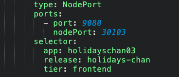


Now we are going to **apply** the definitions:

```
oc apply -f holidays-deployables<xx>.yaml
```

Results: **4 objects** have been created on the cluster HUB

```bash
# oc apply -f holidays-deployables<xx>
channel.app.ibm.com/holidays-chan created
deployable.app.ibm.com/chan-holidays-deployment created
deployable.app.ibm.com/chan-holidays-service created
deployable.app.ibm.com/chan-holidays-route created
```

Now, we are going to define **the application, the placement rule and the subscription.** 

You can also look at the holidays-project<xx>.yaml file. 

```bash
cat holidays-project<xx>.yaml
```

Results:

```
apiVersion: app.k8s.io/v1beta1
kind: Application
metadata:
  name: holidays-app03
  namespace: holidays-project03
  labels:
    app: holidaysapp
spec:
  selector:
    matchExpressions:
    - key: release
      operator: In
      values:
      - holidays03
  componentKinds:
  - group: app.ibm.com
    kind: Subscription
---
apiVersion: app.ibm.com/v1alpha1
kind: Subscription
metadata:
  name: holidays-sub03
  namespace: holidays-project03
  labels:
    app: holidaysapp
    release: holidays03
spec:
  channel: holidays-deployables03/holidays-chan03
  name: ""
  packageFilter:
    version: ">=1.x"
    labelSelector:
      matchLabels:
        package: modresort
        component: main
  placement:
    placementRef:
      name: holidays-pla03
      kind: PlacementRule
      group: app.ibm.com
  overrides:
  - clusterName: "/"
    clusterOverrides:
    - path: "metadata.namespace"
      value: default
---
apiVersion: app.ibm.com/v1alpha1
kind: PlacementRule
metadata:
  name: holidays-pla03
  namespace: holidays-project03
  labels:
    app: holidaysapp
    release: holidays03
spec:
  clusterReplicas: 1
  clusterLabels:
    matchLabels:  
      environment: QA
---
```

Normally there are one project for the application (and subscription and placement rule) and another project for the channel and deployables. 

Now create a new project and apply the yaml file (chnage <xx> with your number)

```
oc new-project holidays-project<xx>
oc project holidays-project<xx>
oc apply -f holidays-project<xx>.yaml
```

Results:

```bash
# oc apply -f holidaysapp<xx>.yaml
application.app.k8s.io/holidays-app20 created
subscription.app.ibm.com/holidays-sub20 created
placementrule.app.ibm.com/holidays-pla20 created
```


#  Task 3 - Deploy the application


Check that the subscription has been propagated

```
#  oc get subscription.app.ibm.com --all-namespaces
NAMESPACE                  NAME              STATUS       AGE
holidays-project<xx>   holidays-sub<xx>    Propagated   88s


```

Now go to the CP4MCM console.

Click on **Menu>Mange Applications>Hybrid Applications**

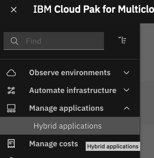

You should see the following page:

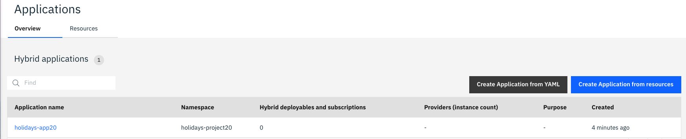

Click on the application, then you should see something similar with your **number**:

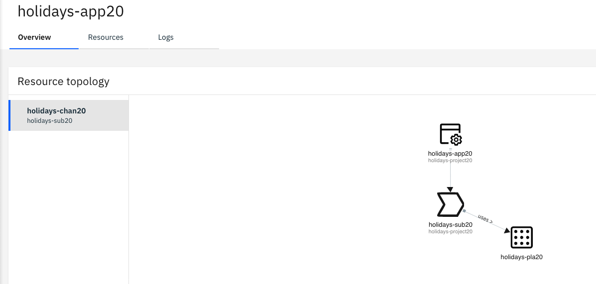


We notice, that the application has not been deployed (pod, service and route are all missing).

To remedy to that situation, click on the placement rule:

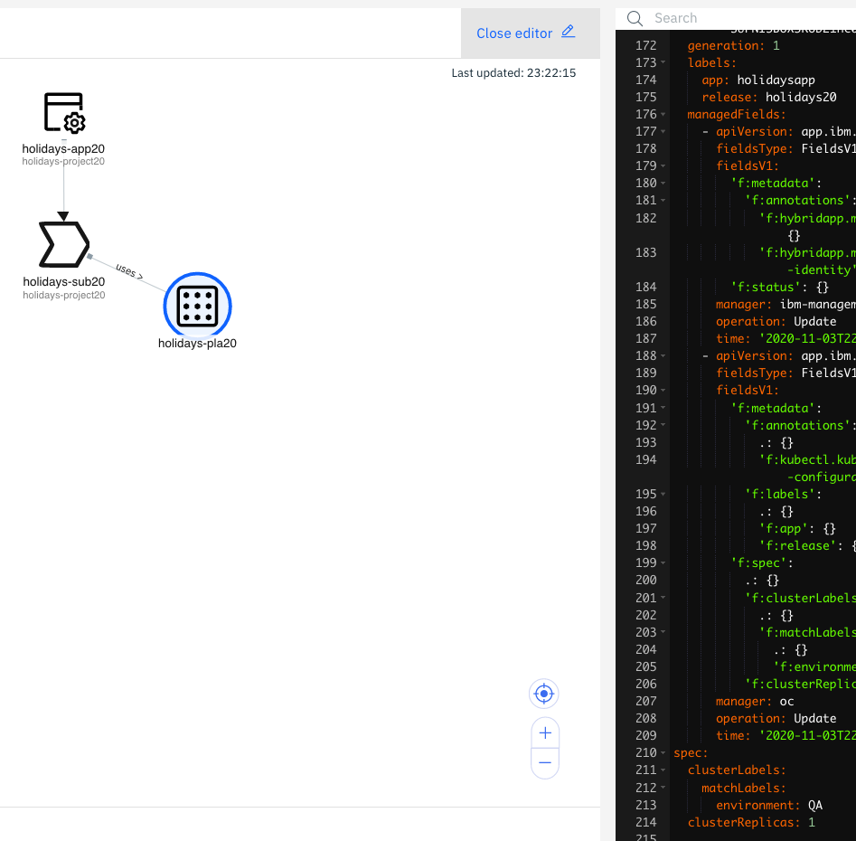

Navigate to the bottom of the yaml file : 

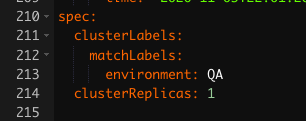

These lines indicate that we must deploy the application on only one cluster (clusterReplicas: 1) and to a QA cluster (environment: QA). 

Change QA with **QA<xx>** with you number

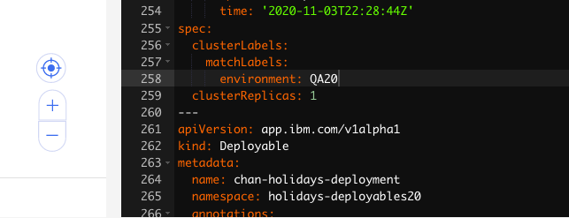

And save your change with this icon (at the top of the editor)


Let's check our cluster : Go to **Menu>Automate Infrastructure>Clusters** 

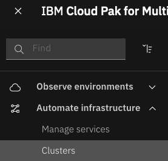

You can view and add labels to identify your managed cluster. On the managed-cluster row (with your number), click the three dots icon and select **Edit labels** :


Then add a new label named **environment** with a value of QA<xx>  

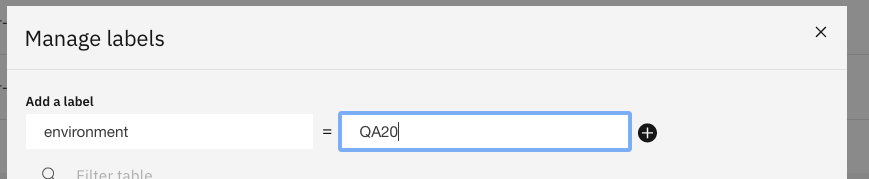

Then **Click +** and then **Save**.

Doublecheck the labels:


Then go back to the Hybrid Applications : As you can, the application has been deployed.

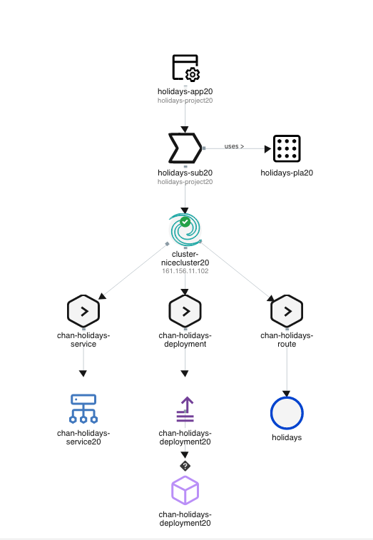

The application has been now deployed to the cluster.

Wait a little bit until the pod turn to green:


If you remember your nodePort from the service deployable (it should be **301xx**), you can now get access to the application that is running on pure Kubernetes, juste use the IP of that cluster. To get the IP click on the cluster:


```
http://<IP>:301xx/resorts/
```

You will get the following page: 


If you have multiple clusters, you can try to change the labels and then deploy your application on multiple clusters. 


# Congrats

You successfully  created some artifacts to deploy an application on multiple clusters using the SIG Apps concepts and the hybrid application capability in Cloud Pak for Multicloud Management. 


Thanks.

---

