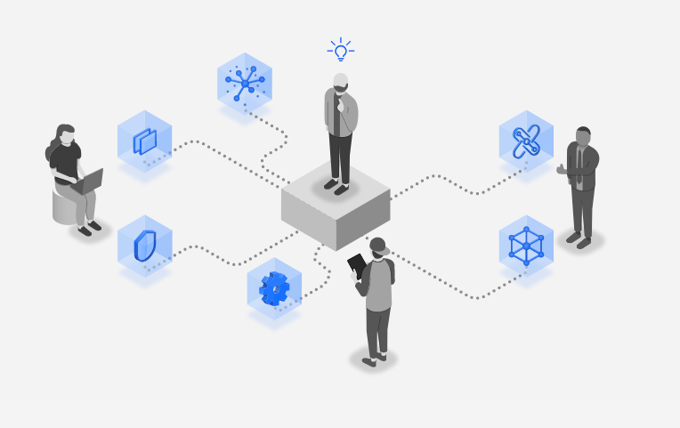
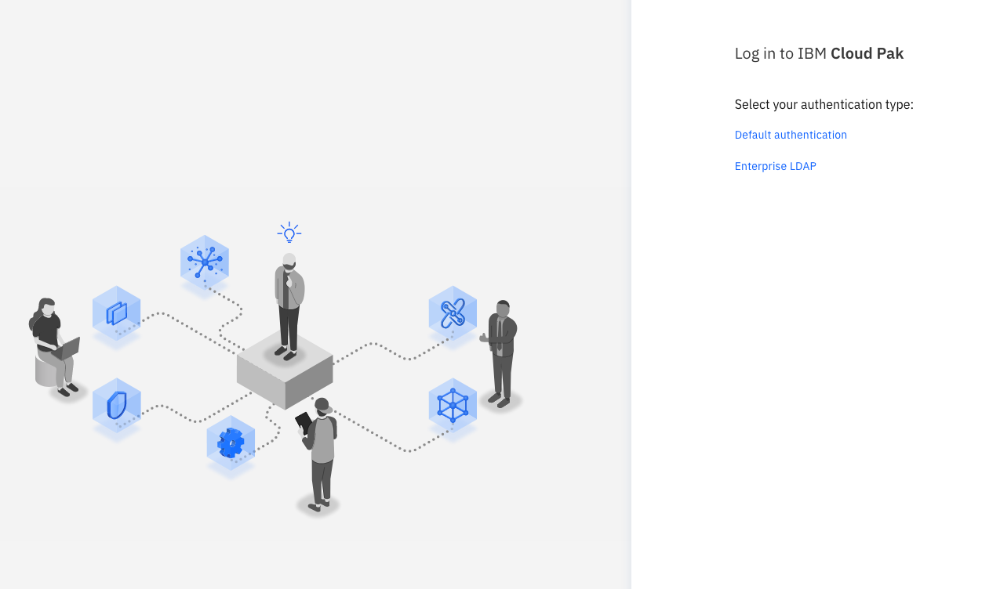
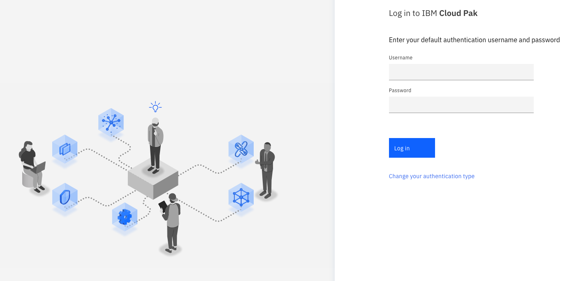
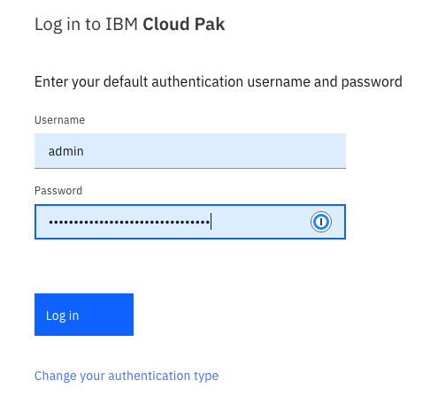
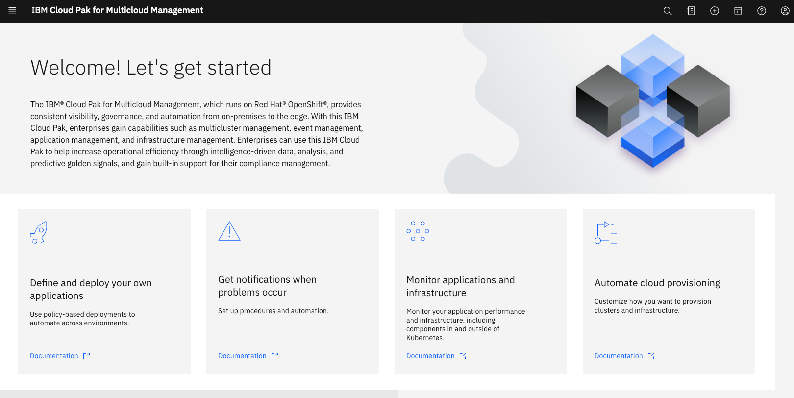
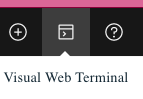
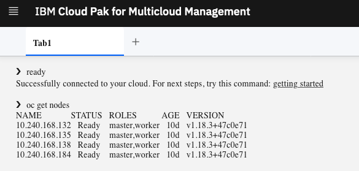

# IBM Cloud Pak for Multicloud Manager Labs

# Lab #3: Deployables





Philippe Thomas - September 2020


# Introduction

IBM Cloud Pak for Multicloud Management enables you to securely  **manage applications**, wherever your applications are deployed. IBM Cloud  Pak for Multicloud Management provides you with tools and a hybrid  application model that you can use to create applications and application resources across different  deployment platforms, manage the lifecycle of your applications and  infrastructure, and deliver observability for the application’s full  stack.

The application management functions within IBM Cloud Pak for  Multicloud Management provide you with unified and simplified options  for constructing and deploying applications and application updates.  With these functions, your developers and DevOps personnel can create and manage applications across  environments.

To achieve this goal, IBM Cloud Pak for Multicloud Management  uses a **Hybrid Application Model**. This model includes default Kubernetes  resource definitions and custom resource definitions to represent and  manage application components.

In the previous versions of IBM Cloud Pak for Multicloud  Management, all applications and application resources were based on the  **Kubernetes Special Interest Groups (SIG) Application model**. With this  hybrid application model, custom resources are  added to support representing **non-Kubernetes resources** with  Kubernetes custom resources to manage these resources as part of an  Application. For instance, you can represent your infrastructure  deployers, such as Infrastructure management or Ansible         as `Deployer` resources. With the support for  infrastructure deployers, you can create hybrid deployable resources  that represent components that run on these different Deployers, such as  virtual machines, cloud services, and containers.

The applications that you create by blending the Kuberenetes  resources with non-Kubernetes resources are known as hybrid  applications. The Kubernetes resource specification for representing a  hybrid application with this hybrid application model  is still the standard Kubernetes `Application` resource that was used in previous versions of the IBM Cloud Pak for Multicloud Management. New hybrid deployable (`Deployable.core.hybridapp.io`) and deployer (`Deployer`)   resources are introduced and work alongside the existing deployable (`Deployable.app.ibm.com`), channel (`Channel`), subscription (`Subscription`) and placement rule (`PlacementRule`) resources for creating   and managing your hybrid applications.

With this consistent application model, users can visualize  their hybrid applications. Hybrid applications are rendered into a  unified visual experience that brings together application components  that are deployed to VMs and or containers and across   cloud services. These views span teams so that operators can  quickly understand each application. Additionally, this visualization  provides your users with simplified options for constructing and  deploying your hybrid applications and any subsequent  updates to the applications.

With these functions, your developers and DevOps personnel can  create and manage applications across environments and functional teams  through channel and subscription-based automation. During this lab, we are going to manipulate some important aspects of the **console** of IBM Cloud Pak for Multicloud Manager (CP4M for short in this document) and especially the **hybrid application feature** to deploy and move applications to some managed clusters. 


# Task 1 - Access CP4M console

Be sure to use the latest **Firefox** internet browser.  

To get access the CP4M console, the instructor will give you a URL similar to the one below:

```http
https://cp-console.niceaz-ba36b2ed0b6b09dbc627b56ceec2f2a4-0000.ams03.containers.appdomain.cloud
```

The Credentials are **admin** and a password given by the instructor.  

Then you should see the following sign on page:




For this exercise, we want to get access to the **Cluster Administrator** role, so click on the Default authentication link in the page:



Then type **admin** and the  password from the instructor.



Click **Log in** and here it is : the welcome page should appear:




Click on the visual web terminal:



Check that you are connected to the Hub Cluster:

```
oc get nodes
```

Results:




# Task 2 - Define the Application components

Go to the following github repository:

``` 
https://github.com/phthom/cp4m/holidays
```

Download the repository to your workstation by using the code button:


Then use the item to download the repository (zip file):


Unzip the file into a directory and move to that **directory**

```bash
cd holidays
ls *
```

List all files

```bash
ls *
```

Results

```
ls *
holidaysapp:
application.yaml    placementrules.yaml subscription.yaml

holidayschan:
channel.yaml    deployable.yaml

```

Thengo to the visual web terminal on CP4M and type the following commands:

```bash
oc whoami
oc whoami -t
```

Results:


Use admin, the token and the URL of the CP4M console to login to CP4M:

```bash
oc login ...

cloudctl login -a https://cp-console.nicebd-ba36b2ed0b6b09dbc627b56ceec2f2a4-0000.eu-de.containers.appdomain.cloud --skip-ssl-validation -u  admin -p E65fPYsgxYSPfc3grwtA1qD8bDlTYqe1 -n default

```


Create a project that contain the deplyales

```
oc new-project holidays-deployables01
oc project
```


Apply the definitions:

```
oc apply -f holidays-deployables01
```

Results:

```bash
# oc apply -f holidays-deployables01
channel.app.ibm.com/holidays-chan created
deployable.app.ibm.com/chan-holidays-deployment created
deployable.app.ibm.com/chan-holidays-service created
deployable.app.ibm.com/chan-holidays-route created
```


Change project:

```
oc new-project holidays-project01
oc project holidays-project01
oc apply -f holidays-project01
```

Results:

```bash
# oc apply -f holidaysapp01
application.app.k8s.io/holidays666app-holidaysapp created
placementrule.app.ibm.com/holidays666-holidaysapp created
subscription.app.ibm.com/holidays666-holidaystapp created
```


Other Informations: check that the subscription has been propagated

```
#  oc get subscription.app.ibm.com --all-namespaces
NAMESPACE            NAME                        STATUS       AGE
holidays-project01   holidays666-holidaystapp    Propagated   88s

# oc get pods -n default

http://modresorts-default.apps.158.176.85.10.xip.io/resorts/

```


I have added a nodePort 30666 in the service deployable. So to get access to the applications that are running on pure Kubernetes, juste use the IP othat cluster with the following URL:

```
http://<Master IP>/resorts/
```


Test 02


```bash
oc new-project holidays-deployables02
oc project
oc apply -f holidays-deployables02
oc new-project holidays-project02
oc project holidays-project02
oc apply -f holidays-project02

```


Test 03 ---OK -- 2 files - 2 projects

```bash
oc new-project holidays-deployables03
oc apply -f holidays-deployables03.yaml
oc new-project holidays-project03
oc apply -f holidays-project03.yaml
```


## Quote of the day

Using Helm as a channel,

```bash
wget https://raw.githubusercontent.com/yubingjiaocn/qotd/master/mcmqod.tar.gz
tar xvf mcmqod.tar.gz
cd mcmqod
```


# Congrats

You successfully accessed the CP4M console, you imported a new clusted that has been already created, you deployed an application across clusters, you installed the cloudctl command line, and you touched all the main features including the seach function.


Thanks.

---

